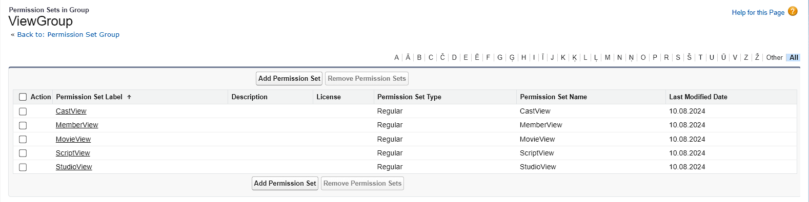
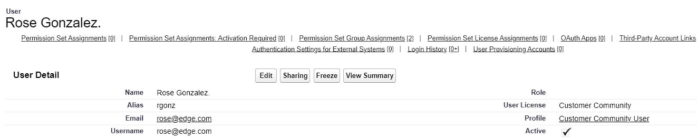
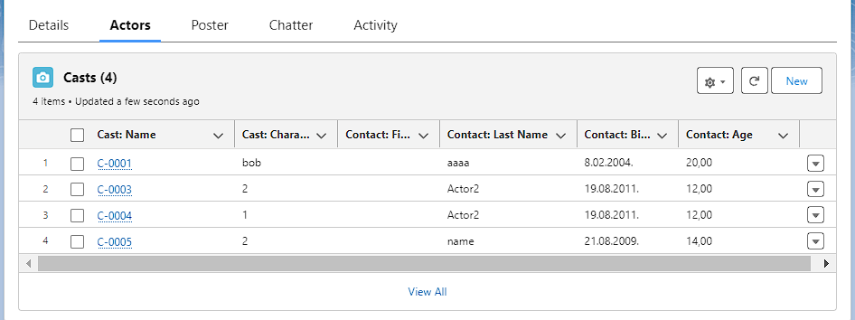
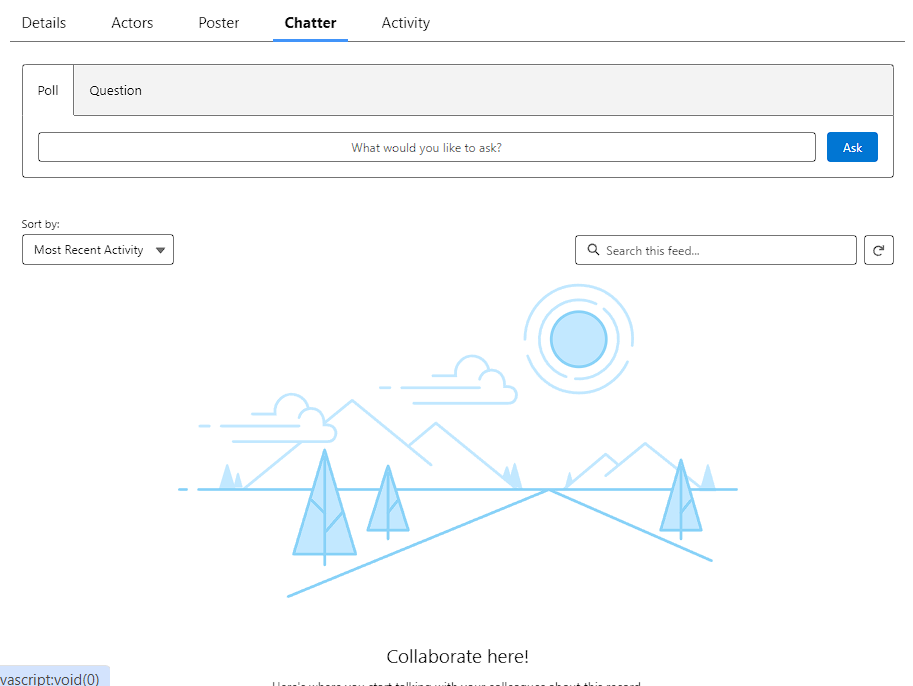

# Salesforce Bootcamp tasks review
Here I'll write brief report about completed tasks with screenshots from my org every week to simplify my project repo review.

## First Week

### Data model
> **Script object fields and relationships**

> **Contact object fields and relationships**

> **Account object fields and relationships**

> **Movie object fields and relationships**  

> **Cast object fields and relationships**  

> **Movie Roll-up fields (Estimated Actor Costs & Actual Actors Costs)**

### Permission task
> **Permission Set Group for Edit**

> **Permission Set Group for View**

> **Community User with its Permission Set Group Assignment**

### Declarative Customisation

#### Lists View

> **Account List View**

> **Script List View** 
> _Recently_
> 
> _All_
> 

> **Movie List View** 
> _Recently_
> 
> _All_
> 

> **Cast List View** 
> _Recently_
> 
> _All_
> 

#### Recod pages
##### Account
> **Full page including** _Details Tab_
> 
> _Related Tab_
> 
> _Conversation Tab_
> 

##### Contact
>**Full page including** _Details Tab_
> 
> _Movies Tab_
> 

##### Cast
>**Full page including** _Details Tab_
> 

##### Script
>**Full page including** _Details Tab_
> 
> _Related Tab_
>  

##### Movie
>**Full page including** _Details Tab_
> 

> _Actors Tab_  
> 

> _Poster Tab_  
> 

> _Chatter Tab_  
> 

> _Activity Tab_  
> 

### Flows
> **Refactored Movie Cast Preparation flow**
  

> **Activated Flow** 
> _Start Screen if not enough actors_
>  
> _Start Screen if not enough actors_
>  
> _Pick from available actors with appropraite skills_
> 
> _Enter Character name for each selected actor_
>  

## Second Week

### Apex classes
> Trigger (in combination with trigger handler) allow us to retrive movie deta 
> 
  

> Batchable Apex class is launched by Scheduable Apex class every business day at 18:00 
> 
  

> It is possible to load records data both with json string and json from static resourse 
> 
  

> Added global variable to turn on/off trigger 
> 
  

### Tests for classes
> Implemented tests for different test scenario (gonna add more) and all tests passed  
> 
  

> Test coverage 
> 
  
### LWC

> **Movie List** page. 20 records are shown. But is able to show more 
> 
  

> **Movie Search** page. **ToDo: add styles** 
> 
  

> **Movie Loader** page. It is possible to load more than 100 records with poster retrieving 
> 

## Third Week

### Web application short overview
> **Homepage with movies from Org records** 
> 

> **Search movies from tmdb integration** 
> 

> **Movie Uploader** 
> 

> **Adding casts automatically with trigger** 
> 

> **Casts in my org**  
> 

> **Trailer** 
> 

> **Reviews from TMDB integration** 
> 

> **More detailed review reading** 
> 

> **New Record By Title - Quick Action on Movie record page (only in my org)**  
> 
## Final results 

> You can find my project here: https://wise-raccoon-lb0p6q-dev-ed.trailblaze.my.site.com/MovieManager/s/

> ⚠️ **Please, don't upload files from Experince Cloud Site: to do it, I need to turn on trigger checkbox in Custom Settings in purpose to reduce count of callouts!** 

> Experince Cloud Site credentials 
> **Username:** ideaport_user@exp.cloud 
> **Password:** i12345678  
(to find smth in search you need to click enter after input)